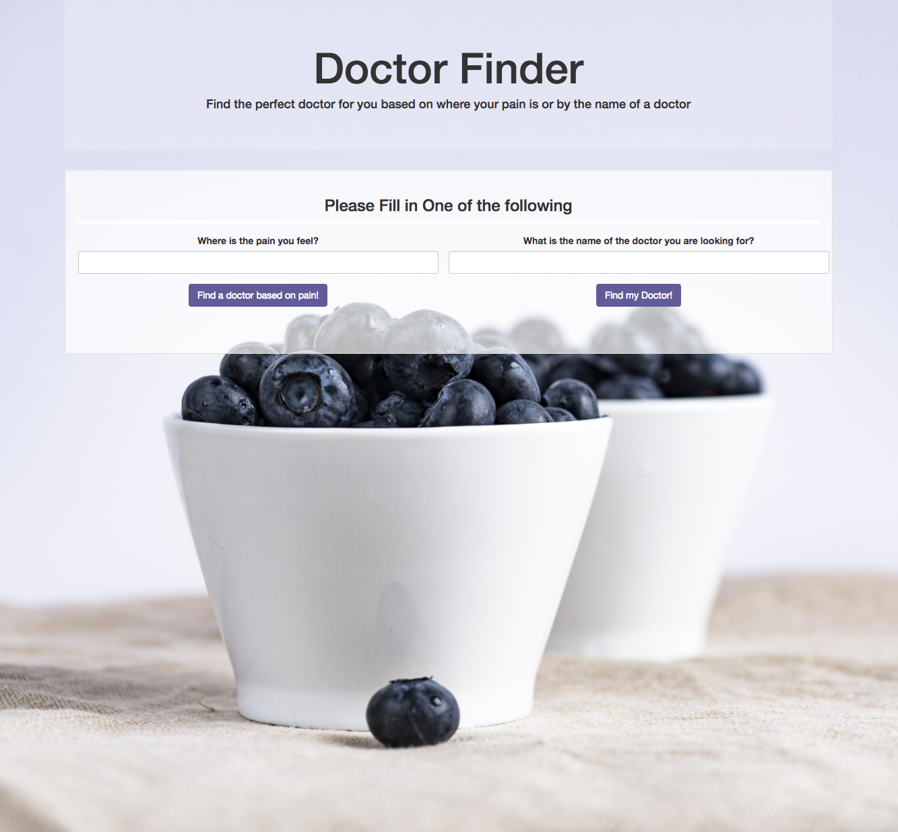
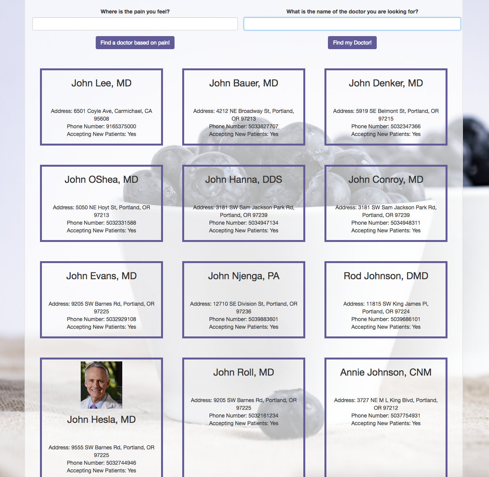
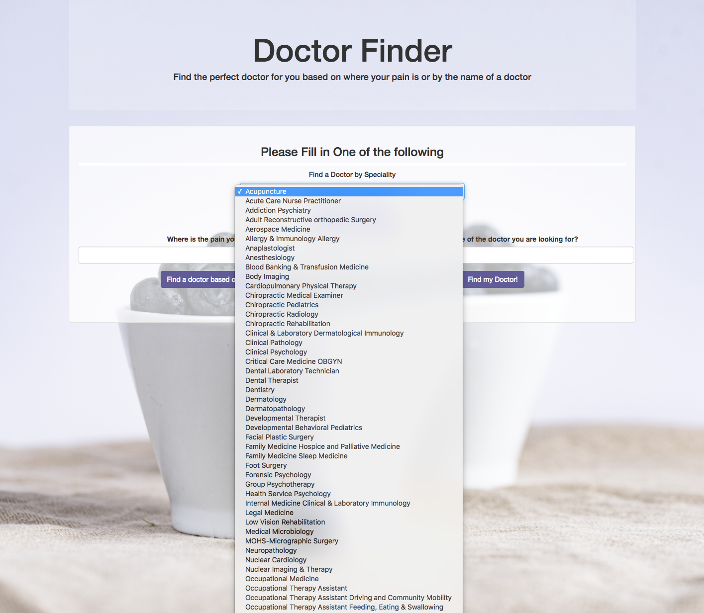
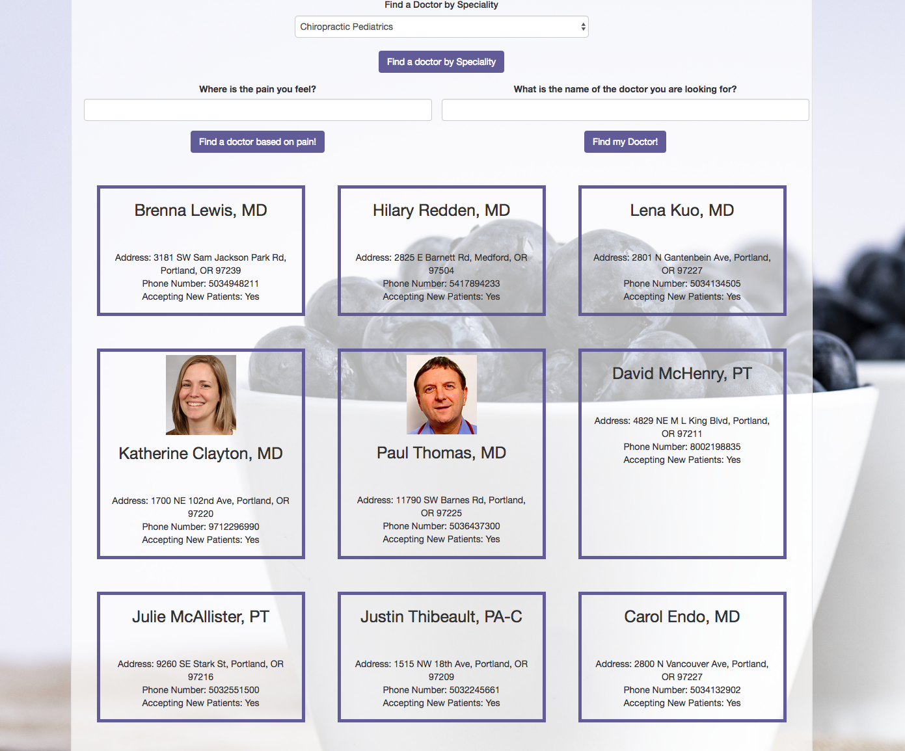

# The Doctor Lookup

#### Epicodus JavaScript Week 2 Project, September 15, 2017

#### By Stephanie Mayer

## Table Of Contents

* [Description](#description)
* [View Of Application](#view-of-application)
* [Set-Up Requirements](#setup-requirements)
* [Specifications](#specifications)
* [Questions or Concerns](#questions-or-concerns)
* [Known Bugs](#known-bugs)
* [Technologies Used](#technologies-used)

## Description

_This application implements an API into it so that you can look up a doctor based off name or based off a symptom that you may be having. The API that is used is provided by Better Doctor._


## View Of Application
### This is what the main page of the application looks like

### The results look like when you search by a condition

### The results look like when you search by a name

### The drop down menu includes 100 different specialties

### The results for the drop down will show you the doctors for that speciality



## Setup Requirements
* Clone the repo from git hub using:
````
$ git clone https://github.com/smayer0926/doctorLookup.git
````
* Open the project in your favorite editor, this was created in Atom.
* Experiment!

_To use tis project you will need the following installed properly on your computer._
* [Node.js](https://nodejs.org/en/)
* Once installed, you will need to install gulp and bower:

````
$ npm install gulp
$ npm install Bower
````

_You will need an API Key from [Better Doctor API](https://developer.betterdoctor.com/)_

* Sign up for a free account, if you don't already have one.
* Copy your API Key that is provided into a file that you create in the project called .env.
* In this file write: exports.apiKey = "YOUR-API-KEY-GOES-HERE"; and save the file.
* Make sure to rebuild the file after making any changes to the js files, using:
````
$ gulp build
````
 or by using:
````
$ gulp serve
````
* Open in your favorite browser, if you just use gulp build, otherwise it will be launched by gulp serve.

## Specifications

| Behavior      | Example Input      | Example Output       |
| ------------- | ------------- | ------------- |
| Enter a symptom, get back a list of doctors | Heart Pain  | John Doe, MD Address: 12100 SE Mystery Ct, Clackamas, OR 97086, Phone number: 555-331-555, Accepting New Patients: Yes |
| Enter a name of a Doctor, get back a list of doctors with that name | Jane | Jane Doe, MD Address: 3181 SW Jackson Rd, Portland, OR 97239, Phone number: 555-809-5555, Accepting New Patients: Yes |

## Questions or Concerns ##
_If there are any questions or concerns, please contact me at smayer0926@gmail.com_

## Known Bugs
_No known bugs at this time._

## Technologies Used

* _Atom_
* _Gulp_
* _Bower_
* _Postman_


### License

Copyright &copy; 2017 Stephanie Mayer
